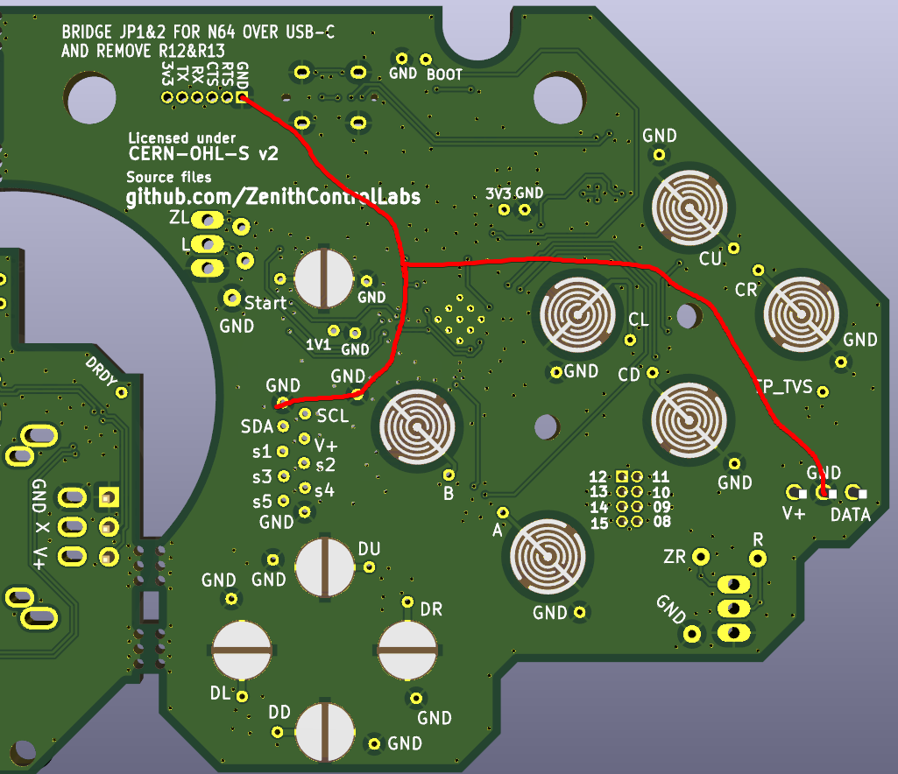
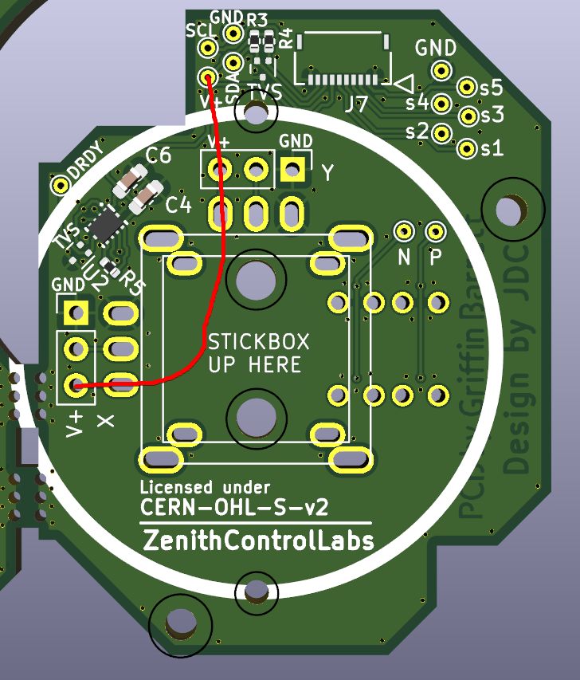
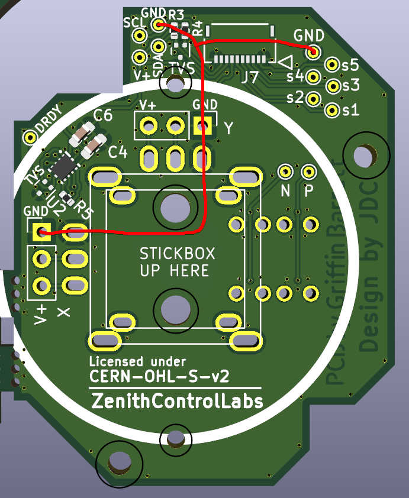
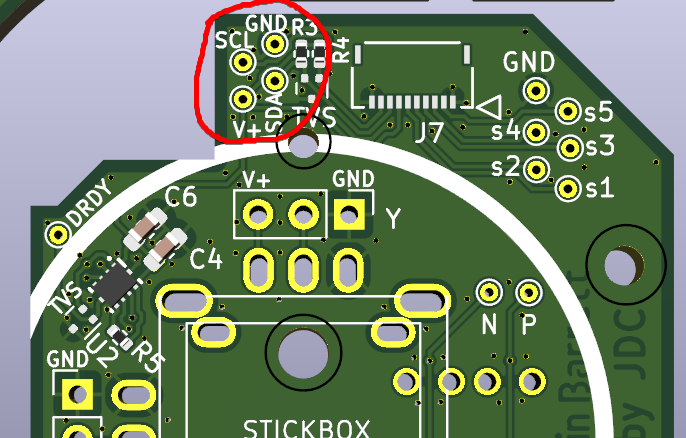

# Mainboard

## Continuity test 

Check continuity between points in the two images:

### 3.3V net (image of bottom side)

### GND net (image of bottom side)

## Smoke test 

Supply 3.3V power to the 3v3 pin and GND pin at the highlighted test points. 
Verify all boards behave "normally": no magic smoke, draws nonzero current, does not draw more than 1A.
Components may be warm but should not be hot to touch after running for any amount of time.

## USB test (if possible)

Ensure the board is not powered through the test points for this test.

Hold down BOOT button highlighted in blue below. Plug in a USB-C cable from the vertical header which would be populated in the area highlighted in red to a computer. Let go of BOOT after plugging in USB-C.

A flash drive should appear labeled RPI-RP2, like so:

Test passes if this is the case. The USB-C can be unplugged safely.

# Stick Board

## Continuity test

Check continuity between points connected in the two images:

### 3.3V net

### GND net

## Smoke test

Supply 3.3V power to the V+ pin and the GND pin at the highlighted test points. 
Verify all boards behave "normally": no magic smoke, draws nonzero current, does not draw more than 1A.
Components may be warm but should not be hot to touch after running for any amount of time.

